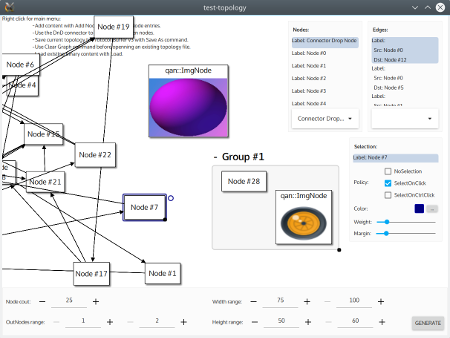

[](https://travis-ci.org/cneben/QuickQanava)  (Linux/g++5/Qt5.8 - OSX/Clang/Qt5.9)

[](https://ci.appveyor.com/project/cneben/quickqanava) (Windows MSVC 2015 x64/Qt5.9)

[](http://www.destrat.io/quickqanava/doc)
[](https://opensource.org/licenses/BSD-3-Clause)
[](https://twitter.com/QuickQanava)


!!! warning "QuickQanava is alpha, interface may change before 1.0.0 release, but QuickQanava is already used extensively in production code." 

!!! note "QuickQanava is licensed under BSD-3, support is available on demand: contact@destrat.io"

`QuickQanava` is a C++14 library designed to display graphs and relational content in a QtQuick application using QML code. QuickQanava provide components and classes to visualize medium-sized directed graphs in a QML application. QuickQanava does not provide advanced layout algorithms, but rather focus on displaying relational content in an advanced dynamic user interface (with DnD support, resizable content, visual connection of nodes).

QuickQanava main repository is hosted on GitHub: https://github.com/cneben/quickqanava

QuickQanava is primarily developed with Qt >= 5.10 with MSVC2015 and g++5.4 (Minimal version number for Qt is 5.7, some samples may need the latest QuickControls2 from Qt 5.8)

+ Project homepage: [http://www.destrat.io/quickqanava](http://www.destrat.io/quickqanava)
+ Reference documentation: [http://www.destrat.io/qanava/doc/index.html](http://www.destrat.io/qanava/doc/index.html)

## Installation

```sh
git clone https://github.com/cneben/QuickQanava
cd QuickQanava
```

[Installing QuickQanava](installation.md)

## Quick Start

[Getting started guide](gettingstarted.md)

## Gallery

[QuickQanava samples](samples.md)

| Node Grouping                | Visual Connection of Nodes         | 
| :---:                       | :---:             | 
|  |  | 
|  |  | 



## Roadmap:

  - **v0.9.2:**:	 
    - [ ] Add smarter heuristics for edges's Bezier curve control points generation.
    - [ ] Add full support for groups inside group (ie subgraphs).
    - [X] Remove QuickGeoGL support, QuickQanava will become Qt 5.10 only.
	- QuickContainers (Qt/QML observable adapter for STL or Qt containers):
		- [ ] Redesign QuickContainers: qcm::ContainerModel<> memory footprint is too high (inheritance from QAbstractItemModel comes with a strong virtual and signals/slots overhead)
		- [ ] Add support for standard library containers.
		- [ ] Increase test coverage.
  - **v1.0.0: Advanced edge visualization**	 
    - GTpo (Configurable topology library):
	  - [ ] Push test coverage to 100% (ie increase coverage for subgroups).- [80%] Redesign qan::Graph interface for creating content.
    - [ ] Publish the 4k sample (40k is probably too much for QML without dedicated culling and LOD code).
    - [ ] Fix current qan::PointGrid bugs and add "snap to grid" support.


